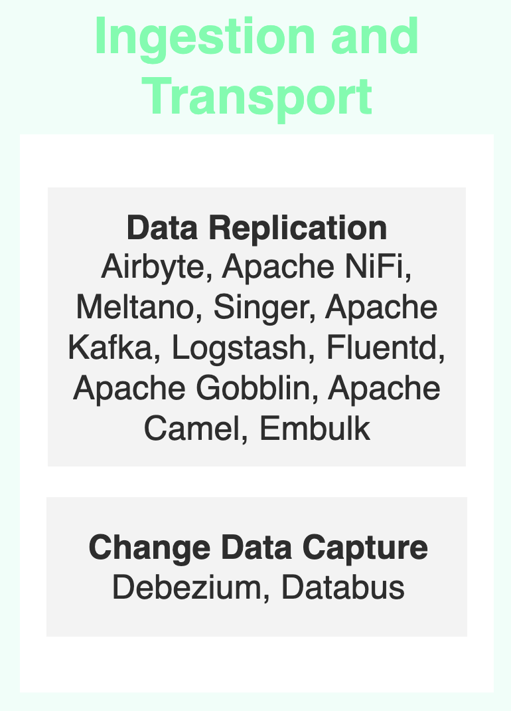

# Data Ingestion and Transport Tools

Data ingestion and transport are crucial processes in the field of data management. They involve collecting, moving, and integrating data from various sources into a centralized location, typically a data warehouse or data lake. These processes are essential to ensure that data is available, up-to-date, and ready for analysis.

## Data Replication

Data replication is the process of copying and synchronizing data between different systems or locations. It allows for maintaining consistent copies of data across multiple servers or sites, thus improving the availability, reliability, and performance of applications that depend on this data.

## Change Data Capture (CDC)

Change Data Capture (CDC) is a technique that identifies and captures changes made to data in a source, then transfers these changes to a target in real-time or near real-time. This approach is particularly useful for keeping systems synchronized without having to perform full data transfers each time.

## Available Tools

Here is a summary table of the main open-source data ingestion and transport tools we have identified.

### Data Replication

| Tool | Subcategory | Creation Date | Stars | Forks | Contributors | Last Release | Latest Commit | Meets Criteria* | Link |
|------|-------------|---------------|-------|-------|--------------|--------------|---------------|-----------------|------|
| Airbyte | Data Replication | 12/07/2020 | 15616 | 4019 | 972 | 24/09/2024 | 25/09/2024 | Yes | https://github.com/airbytehq/airbyte |
| Apache NiFi | Data Replication | 13/11/2014 | 4788 | 2668 | 483 | N/A | 26/09/2024 | Yes | https://github.com/apache/nifi |
| Meltano | Data Replication | 28/08/2018 | 1787 | 156 | 126 | 25/09/2024 | 25/09/2024 | Yes | https://github.com/meltano/meltano |
| Singer | Data Replication | 23/01/2017 | 536 | 130 | 28 | N/A | 03/09/2024 | Yes (all tap) | https://github.com/singer-io/singer-python |
| Apache Kafka | Data Replication | 03/08/2011 | 28468 | 13859 | 1195 | N/A | 26/09/2024 | Yes | https://github.com/apache/kafka |
| Logstash | Data Replication | 23/05/2009 | 14188 | 3496 | 459 | 10/09/2024 | 25/09/2024 | Yes | https://github.com/elastic/logstash |
| Fluentd | Data Replication | 12/10/2011 | 12850 | 1339 | 245 | 20/08/2024 | 26/09/2024 | Yes | https://github.com/fluent/fluentd |
| Apache Gobblin | Data Replication | 02/10/2014 | 2214 | 744 | 112 | 20/07/2017 | 19/09/2024 | No | https://github.com/apache/gobblin |
| Apache Camel | Data Replication | 19/03/2007 | 5526 | 4936 | 1065 | N/A | 26/09/2024 | Yes | https://github.com/apache/camel |
| Embulk | Data Replication | 01/02/2015 | 1748 | 201 | 49 | 17/09/2024 | 24/09/2024 | Yes | https://github.com/embulk/embulk |

### Change Data Capture

| Tool | Subcategory | Creation Date | Stars | Forks | Contributors | Last Release | Latest Commit | Meets Criteria* | Link |
|------|-------------|---------------|-------|-------|--------------|--------------|---------------|-----------------|------|
| Debezium | Change Data Capture | 25/03/2016 | 10471 | 2497 | 540 | N/A | 25/09/2024 | Yes | https://github.com/debezium/debezium |
| Databus | Change Data Capture | 10/10/2012 | 3634 | 732 | 12 | N/A | 07/05/2020 | No | https://github.com/linkedin/databus |

*Criteria: >40 contributors, >500 stars, and recent releases/commit

## Tool Details

### Data Replication

1. **Airbyte**: An open-source data integration platform focusing on ELT (Extract, Load, Transform). It offers a wide range of connectors and is designed for easy customization.
2. **Apache NiFi**: A software project for automating and managing the flow of data between systems. It provides a web-based interface for designing, controlling, and monitoring data flows.
3. **Meltano**: An open source ELT platform built by GitLab. It integrates with Singer taps and targets, making it versatile for various data sources and destinations.
4. **Singer**: An open-source standard for writing scripts that move data. It defines a JSON-based data exchange format that works with various sources and destinations.
5. **Apache Kafka**: While primarily a distributed event streaming platform, Kafka is often used for data ingestion due to its high-throughput, fault-tolerant architecture.
6. **Logstash**: Part of the Elastic Stack, Logstash is a server-side data processing pipeline that ingests data from multiple sources simultaneously, transforms it, and then sends it to your favorite "stash."
7. **Fluentd**: An open source data collector for unified logging layer. It allows you to unify data collection and consumption for better use and understanding of data.
8. **Apache Gobblin**: A distributed data integration framework that simplifies common aspects of big data integration such as data ingestion, replication, organization and lifecycle management.
9. **Apache Camel**: A versatile open-source integration framework based on known Enterprise Integration Patterns. It supports a vast array of protocols and data formats.
10. **Embulk**: An open-source bulk data loader that helps data transfer between various databases, storages, file formats, and cloud services.

### Change Data Capture

1. **Debezium**: An open-source distributed platform for change data capture. Built on top of Apache Kafka, it provides a set of Kafka Connect compatible connectors that monitor specific database management systems, capturing row-level changes in real-time.
2. **Databus**: Developed by LinkedIn, Databus is a source-agnostic distributed change data capture system. It's designed for online low-latency consumption of high-volume database changes.

When choosing a data ingestion and transport tool, consider factors such as the types of data sources and destinations you need to support, the volume and velocity of your data, your team's technical expertise, and integration with your existing data stack.

When choosing a CDC tool, consider factors such as your source database system, target systems, latency requirements, and scalability needs.

It's often beneficial to test a few different solutions to find the one that best fits your specific use case and requirements. The open-source nature of these tools allows for extensive customization and community support, which can be crucial for addressing unique data ingestion challenges or change data capture.

## The Challenge of Choice
The open-source community has developed numerous solutions for various aspects of data handling, including:
- [Ingestion and Transport](01.ingestion_and_transport.md)
- [Storage](02.storage.md)
- [Query and Processing](d03.query_and_processing.md)
- [Analysis and Output](04.analysis_and_output.md)
- [Platform Management](05.platform_management.md)