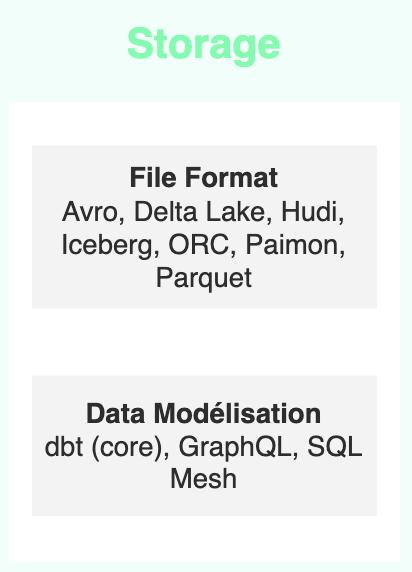

# Data Storage Tools and Formats

Data storage is a fundamental aspect of any data management strategy. It involves organizing and preserving data in various formats and systems to ensure efficient access, retrieval, and analysis. In the context of big data and modern analytics, choosing the right storage solution is crucial for performance, scalability, and data integrity.

## File Formats

File formats play a crucial role in data storage, affecting how data is organized, compressed, and accessed. Different file formats offer various advantages in terms of read/write speed, compression ratio, and compatibility with different processing engines.

## Data Modeling

Data modeling is the process of creating a visual representation of either a whole information system or parts of it to communicate connections between data points and structures. The goal is to illustrate the types of data used and stored within the system, the relationships among these data types, the ways the data can be grouped and organized, and its formats and attributes.

## Available Tools and Formats

Here is a summary table of the main data storage tools and formats we have identified.

### File Format

| Tool | Subcategory | Creation Date | Stars | Forks | Contributors | Last Release | Latest Commit | Meets Criteria* | Link |
|------|-------------|---------------|-------|-------|--------------|--------------|---------------|-----------------|------|
| Avro | File Format | 23/04/2009 | 2895 | 1618 | 364 | 05/08/2024 | 24/09/2024 | Yes | https://github.com/apache/avro |
| Delta Lake | File Format | 24/04/2019 | 7467 | 1680 | 336 | 24/09/2024 | 25/09/2024 | Yes | https://github.com/delta-io/delta |
| Hudi | File Format | 05/01/2019 | 5341 | 2417 | 478 | 16/07/2024 | 26/09/2024 | Yes | https://github.com/apache/hudi |
| Iceberg | File Format | 24/10/2017 | 6208 | 2166 | 502 | 27/08/2024 | 26/09/2024 | Yes | https://github.com/apache/iceberg |
| ORC | File Format | 15/01/2013 | 680 | 482 | 128 | 13/09/2024 | 23/09/2024 | Yes | https://github.com/apache/orc |
| Paimon | File Format | 20/06/2022 | 2341 | 923 | 186 | N/A | 26/09/2024 | Yes | https://github.com/apache/paimon |
| Parquet | File Format | 01/04/2013 | 2569 | 1403 | 228 | 28/08/2024 | 25/09/2024 | Yes | https://github.com/apache/parquet-mr |

### Data Modeling

| Tool | Subcategory | Creation Date | Stars | Forks | Contributors | Last Release | Latest Commit | Meets Criteria* | Link |
|------|-------------|---------------|-------|-------|--------------|--------------|---------------|-----------------|------|
| dbt | Data Modeling | 09/02/2016 | 9674 | 1604 | 312 | 24/09/2024 | 26/09/2024 | Yes | https://github.com/dbt-labs/dbt-core |
| GraphQL | Data Modeling | 02/09/2015 | 14285 | 1124 | 132 | 27/10/2021 | 06/08/2024 | Yes | https://github.com/graphql/graphql-spec |
| SQL Mesh | Data Modeling | 15/02/2022 | 1638 | 146 | 65 | 25/09/2024 | 26/09/2024 | Yes | https://github.com/TobikoData/sqlmesh |

*Criteria: >40 contributors, >500 stars, and recent releases/commit

## Tool and Format Details

### File Format

1. **Avro**: A row-based storage format, Avro is a data serialization system that provides rich data structures and a compact, fast, binary data format.
2. **Delta Lake**: An open-source storage layer that brings ACID transactions to Apache Spark and big data workloads.
3. **Hudi**: (Hadoop Upserts Deletes and Incrementals) Hudi is a data lake storage system that manages storage of large analytical datasets on distributed file systems.
4. **Iceberg**: A high-performance format for huge analytic tables, designed for Hadoop and cloud data platforms.
5. **ORC**: (Optimized Row Columnar) A highly efficient way to store Hive data. It was designed to overcome limitations of other Hive file formats.
6. **Paimon**: A streaming data lake platform that supports high-speed data ingestion, changelog tracking, and efficient real-time analytics.
7. **Parquet**: A columnar storage file format available to any project in the Hadoop ecosystem. Parquet is built from the ground up with complex nested data structures in mind.

### Data Modeling

1. **dbt**: A command-line tool that enables data analysts and engineers to transform data in their warehouses more effectively.
2. **GraphQL**: A query language for APIs and a runtime for executing those queries with your existing data. It provides a complete and understandable description of the data in your API.
3. **SQL Mesh**: An open-source tool for building and managing data transformations, with a focus on data modeling and lineage.

When choosing storage and data modeling tools, consider factors such as data volume, query patterns, integration with existing systems, scalability requirements, and the specific needs of your data team. For file formats, think about compression, schema evolution capabilities, and compatibility with your processing engines. For data modeling tools, consider the complexity of your data relationships, the need for version control, and collaboration features.

It's often beneficial to combine multiple tools. For example, you might use Parquet for efficient storage and dbt for transformation and modeling. The key is to create a flexible, scalable data infrastructure that supports your current needs and can evolve with your organization's data strategy.

Remember, the choice of storage format and data modeling tools can significantly impact query performance, data governance, and the overall efficiency of your data operations. It's worth investing time in selecting the right combination of tools for your specific use case.