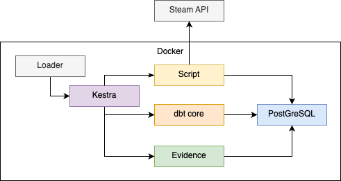

# Data Games Viz
An application to understand statistics of [Steam](https://store.steampowered.com)

## Table of Contents
- [Prerequisites](#prerequisites)
- [Installation](#installation)
- [Technical Architecture](#technical-architecture)
- [User Interface Guide](#user-interface-guide)
- [Troubleshooting](#troubleshooting)

## Prerequisites
- Docker Engine 24.0+
- Docker Compose 2.0+
- 2GB of free disk space
- Internet connection for Steam API access
- Modern web browser (Chrome 88+, Firefox 87+, Safari 14+)

## Installation

### Download
Using git:
```sh
git clone git@github.com:olexya/data-games-viz.git
cd data-games-viz
```

### Deployment
Start the application using Docker:
```sh
docker-compose up -d
```
The initial setup may take 3-5 minutes depending on your internet connection.

### Verification
1. Check if all containers are running:
```sh
docker-compose ps
```
2. Access the application at [localhost:3000](http://localhost:3000)
3. Verify the logs for any errors:
```sh
docker-compose logs
```
## Technical Architecture

Our data pipeline implements a modern, scalable architecture designed to process and analyze gaming data from Steam. This system leverages a medallion architecture (Bronze, Silver, Gold) combined with industry-leading tools for orchestration, transformation, and visualization. 

This diagramm illustrates the end-to-end flow of gaming data through our system, from ingestion to visualization:



1. The "Loader" container enables Kestra to load and execute the configured data flows. This serves as the orchestration entry point for the entire pipeline.
2. Kestra begins by executing the initial step: a script that fetches data from Steam's API. For demonstration purposes, we've intentionally limited the data volume to ensure quick execution times, though these limits can be adjusted as needed. The script stores the raw data in a Bronze layer, following the medallion architecture principles.
3. Next, Kestra runs the dbt commands to update the Silver layer tables. This transformation step cleanses and structures the raw data, preparing it for analytical use. The Silver layer serves as a source of trusted, validated data.
4. Finally, Kestra triggers Evidence to refresh its visualizations and reports using the data from the Silver layer. This represents the Gold layer of our architecture, where data is presented in its final, business-ready form for end-user consumption.

## User Interface Guide

The main page consists of one screen with several interactive elements.

### Filter Panels
The first section contains two filter panels:
* Platforms: Select from a list of available platforms (impacting all elements except the second line)
* Years: Choose from a range of years to view statistics for (also impacting all elements except the second line)

### General Data
The second line displays general data values, which remain unchanged by the filter panels.

#### Tab Panel
The main content area is divided into three tabs:

##### Games

* Element 1: Number of games with filters (platforms and years)
* Element 2: Top 3 most rated games, filtered by platforms and year
* Element 3: Number and average price of games by year, filtered by platform

##### Categories

* Element 1: Number of categories with filters (platforms and years)
* Element 2: Top 3 most games in each category, filtered by platforms and year
* Element 3: Number of categories created by year, filtered by platform

##### Platforms

* Element 1: List of available platforms
* Element 2: Interactive graph showing relationships between Single-Player and Multi-player categories across all platforms

#### Game Details Table
The table displays information about specific games. The search bar is impacted by the filter panels and allows for searching by game name, platform, or year.

On clicking an element in the table, a new tab opens on the left of the search bar, displaying detailed information about the selected game.

## Troubleshooting

### Common Issues
1. **Container Startup Failures**
   ```sh
   docker-compose down
   docker-compose up -d --force-recreate
   ```

2. **Data Loading Issues**
   - Check Steam API status
   - Verify API credentials
   - Clear browser cache

3. **Performance Optimization**
   - Adjust filter combinations
   - Use date range constraints
   - Enable browser caching